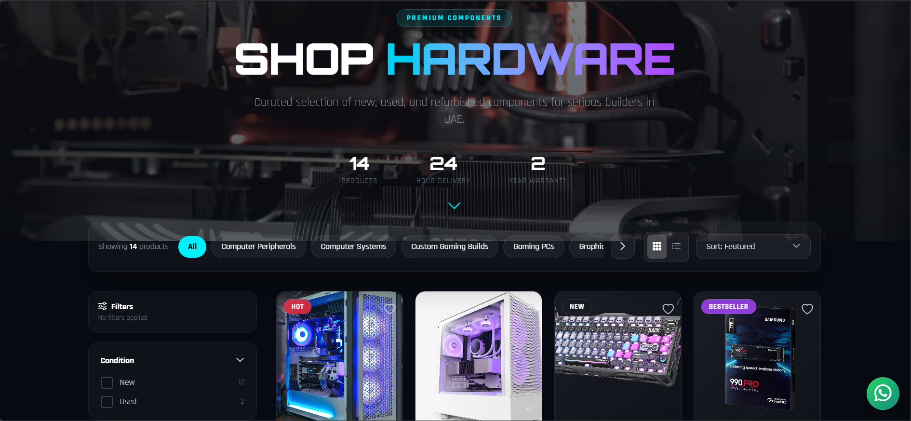
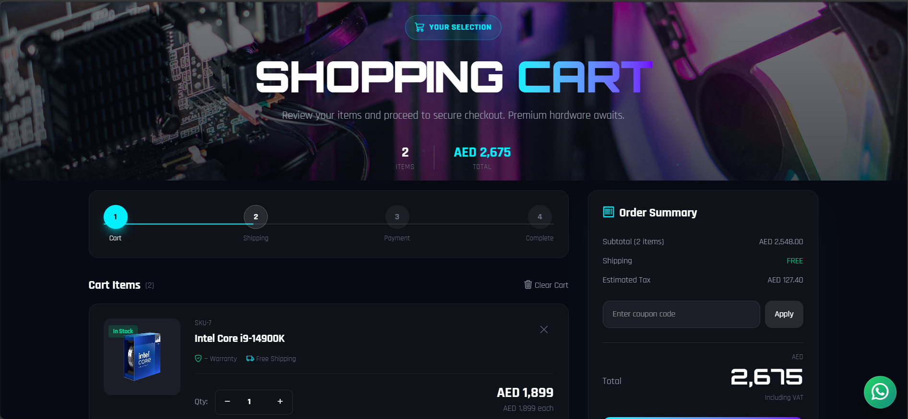

# Digitron Store

Live Website: https://digitroncomputers.com

## Overview

Digitron Store is a full-featured e-commerce platform built with Laravel.
It includes dynamic pricing, coupon system, admin controls, and product management.

## Features

* Product & Category Management
* Dynamic Pricing System
* Coupon & Discount System
* Admin Dashboard
* File Upload System (Documents / Media)
* Responsive UI

## Tech Stack

* Laravel (Backend)
* MySQL (Database)
* JavaScript / jQuery
* Bootstrap / Tailwind

## Installation

1. Clone the repo
2. Run `composer install`
3. Setup `.env`
4. Run `php artisan migrate`
5. Run `php artisan serve`

## Live Demo

https://digitroncomputers.com

## Screenshots

### Homepage

### About Page

### Shop Page

### Product Page

### Cart Page

### Admin Panel

## Author

Anas Ahamed
